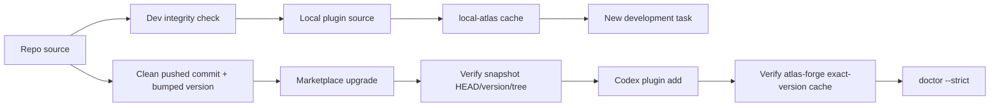

# Atlas Forge 发布完整性与工作流治理实施方案

workflow_id: `20260710-003-atlas-forge`
plan_status: ready-for-user-confirmation
authority: `./contract-index.md`

## 1. 目标

先让 atlas-workflow 的“源码、发布 snapshot、精确版本 cache、当前运行态”具备不可静默分叉和不可降级的机器证明；再让 source contract、host integration、CI 和已有业务门禁成为可复现、可执行的工程合同。

最终需要达到：

- Plugin 内容变化必然产生新的 release identity。
- Dev cache 和 release cache 不再互相覆盖。
- Stale snapshot、同版异 tree、旧版降级在写 release cache 前被阻断。
- Manifest 配置与 runtime 数量/长度约束一致。
- Repo tests 不读取真实 HOME；host integration 专门验证安装态。
- First-code、Product/UI、BAF 双目标拥有 versioned semantic lint。
- Multica 保留兼容态但不再投入，删除另立决策。

## 2. 非目标

- 不修复、迁移、重构、bump 或测试 Multica。
- 不删除现有 Multica plugin、installer 条目或 runtime；删除需要独立批准。
- 不在本计划中实现 outcome metrics、task 新状态、自动清理或 slug 修正。
- 不在本计划中拆分 `codex-workflow` 单体。
- 不规划 Multica listener 模块化。
- 不批量改写历史 workflow docs 或历史 contracts。

## 3. 生命周期和禁写边界

### 3.1 Multica 状态

`multica-sdlc` 状态为 `planned deprecation`：

- 新 orchestration work 使用 Atlas native workflow。
- 现有兼容入口保持可用，但 maintenance-frozen。
- 已知双源漂移作为退役前接受风险记录，不进入修复 backlog。

### 3.2 Forbidden Paths

实施任一 phase 时，以下路径命中即停止：

```text
plugins/multica-sdlc/**
.agents/**
$HOME/.agents/**
$HOME/.local/bin/multica-prd-submit
$HOME/.codex/**/multica-sdlc/**
```

以下共享脚本默认冻结，不承载新的 Atlas 行为：

```text
scripts/install-atlas-forge.sh
scripts/sync-live-agents.sh
scripts/sync-live-workflow.sh
```

`scripts/codex-plugin-update.sh` 保持兼容；Atlas release 优先使用新的专用 helper。只有能够证明其他 selector 输出和副作用完全不变时，才允许它把 `atlas-workflow` selector 委托给专用 helper。

### 3.3 Runtime Isolation

隔离测试必须同时设置：

```text
HOME
CODEX_HOME
CODEX_HOME_ROOT
CODEX_WORKFLOW_ROOT
AGENTS_HOME
LOCAL_BIN_ROOT
```

在测试前后对 forbidden runtime 做 fingerprint。任何真实 Multica runtime 变化都判定为失败。

## 4. 目标通道模型



规则：

- Dev channel 不写 `~/.codex/.tmp/marketplaces/atlas-forge` 或 `cache/atlas-forge`。
- Release channel 不读取未提交 repo tree，不使用 `latest` fallback。
- 自定义脚本不直接写 release snapshot/cache；只有 Codex marketplace/install 命令可以写。
- 失败时保留原已安装 cache，不进行“修补式继续”。

## 5. Phase 1：Manifest 与 Release Identity

### 5.1 目标

消除 manifest runtime WARN，并阻止 plugin tree 变化时复用旧 version。

### 5.2 文件边界

允许：

```text
plugins/atlas-workflow/.codex-plugin/plugin.json
workflow/bin/atlas-plugin-integrity                     # new
workflow/tests/contract_atlas_plugin_integrity.sh       # new
test/fixtures/atlas-plugin-integrity/**                 # new
workflow/tests/contract.sh                              # 仅接入新测试
README.md                                               # 更新 Atlas 命令
```

### 5.3 行为合同

`atlas-plugin-integrity` 提供三个只读模式：

```text
manifest --plugin-root <path>
release --repo <path> --base <git-ref>
layout --source <path> --snapshot <path> --cache <path> --expected-version <version> [--expected-commit <sha>]
```

统一输出 JSON，并在以下情况退出非零：

- `interface.defaultPrompt` 超过 3 项。
- 任一 prompt 超过 128 个 runtime 接受字符。
- plugin tree 相对 base 有变化但 version 未变化。
- 当前 version 已关联另一 tree hash。
- manifest version 为空、cache path 不是精确 version 或输入路径缺失。

Manifest 收敛为最多三个短 prompt：语言、bounded task 入口、native team/clarify 路由。证据预算、artifact 分类和 scaffold 规则继续由 skills/README 承载。

### 5.4 Fixture Matrix

| Fixture | Expected |
| --- | --- |
| 3 prompts、每项 128 以内 | pass |
| 4 prompts | fail |
| 单项 129 边界 | fail |
| plugin 未变、version 未变 | pass |
| plugin 变、version 未变 | fail |
| plugin 变、version 已变 | pass |
| 同 version、不同 tree | fail |

### 5.5 验证

```bash
python3 "${CODEX_HOME:-$HOME/.codex}/skills/.system/plugin-creator/scripts/validate_plugin.py" plugins/atlas-workflow
workflow/bin/atlas-plugin-integrity manifest --plugin-root plugins/atlas-workflow
workflow/bin/atlas-plugin-integrity release --repo "$PWD" --base <phase-base-sha>
bash workflow/tests/contract_atlas_plugin_integrity.sh
```

### 5.6 提交和回退

- 一个 keeper commit。
- Cachebuster/version 是该 commit 中最后完成的 release identity 变更。
- 后续若再修改 `plugins/atlas-workflow/**`，必须在对应 release slice 再次 bump。
- 已发布 version 不复用；回退通过发布“旧内容 + 新 version”，不原地覆盖。

### 5.7 Stop Conditions

- Runtime 对 128 的实际边界与 checker 不一致。
- Release check 需要联网或写 cache 才能判断。
- Diff 命中 forbidden paths。

## 6. Phase 2：Dev/Release 隔离与防降级

### 6.1 目标

消除本地开发 rsync 和 Git marketplace install 对同一 release cache 的竞争。

### 6.2 文件边界

允许：

```text
scripts/update-atlas-workflow-plugin                    # 收敛为 dev-only
scripts/sync-live-atlas-workflow.sh                     # new, Atlas-only
scripts/update-atlas-workflow-marketplace               # new, release-only
scripts/verify-atlas-workflow-install.sh                # new, read-only verifier
workflow/tests/integration_atlas_plugin_layout.sh       # new hermetic fixtures
workflow/tests/integration_atlas_plugin_install.sh      # new isolated real-CLI gate
README.md
```

冻结 shared/full install scripts，不修改 Multica source 或 runtime。

### 6.3 Dev Channel

`scripts/update-atlas-workflow-plugin` 调整为：

- 校验 repo Atlas plugin。
- 同步 repo source 到 local plugin source。
- 刷新 `local-atlas/atlas-workflow/local`。
- 通过新 `sync-live-atlas-workflow.sh` 同步 workflow helpers、Atlas `.codex/agents` 和 shims。
- 不写 Git marketplace checkout。
- 不写 `cache/atlas-forge`。
- 不调用 `sync-live-agents.sh`。
- 删除 `latest` cache fallback。

### 6.4 Release Channel

`scripts/update-atlas-workflow-marketplace` 执行：

1. Preflight：repo clean、HEAD 与 `origin/main` 一致、release identity check 通过。
2. 记录当前 exact cache 和 Multica runtime fingerprint。
3. `codex plugin marketplace upgrade atlas-forge`。
4. 在 `plugin add` 前验证 snapshot HEAD、manifest version 和 plugin tree 与预期一致。
5. `codex plugin add atlas-workflow@atlas-forge`。
6. 验证 `cache/atlas-forge/atlas-workflow/<exact-version>` 存在且 tree 等于 snapshot/source。
7. 验证没有旧版降级、没有同版异 tree、Multica runtime fingerprint 未变。
8. 运行 strict doctor。

### 6.5 Negative Fixtures

| Case | Required Result |
| --- | --- |
| snapshot commit 旧于 expected | add 前失败；原 cache 不变 |
| snapshot version 相同但 tree 不同 | add 前失败 |
| target exact cache 缺失 | install 失败 |
| target cache tree 不同 | postflight 失败并报告，不原地修补 |
| 已安装 version 新于 snapshot | downgrade 失败 |
| `latest` 目录存在但 exact version 不存在 | 失败，不 fallback |
| 命令尝试写真实 `.agents` | 失败 |

### 6.6 验证

```bash
bash workflow/tests/integration_atlas_plugin_layout.sh
HOME="$(mktemp -d)" \
CODEX_HOME="$HOME/.codex" \
CODEX_HOME_ROOT="$HOME/.codex" \
CODEX_WORKFLOW_ROOT="$HOME/.codex/workflow" \
AGENTS_HOME="$HOME/.agents" \
LOCAL_BIN_ROOT="$HOME/.local/bin" \
  bash workflow/tests/integration_atlas_plugin_install.sh
```

真实 Codex CLI E2E 如果不能在 hosted CI 固定版本，则保留为发布前本地/self-hosted required gate；layout fixtures 仍必须进入普通 CI。

### 6.7 提交边界

- Dev channel 收敛和 Atlas-only sync：一个 commit。
- Release helper、verifier 和防降级 fixtures：一个 commit。
- 不与 strict doctor 混在同一 commit。

## 7. Phase 3：Plugin-scoped Strict Doctor

### 7.1 目标

让安装态漂移成为明确的非零退出，而不是仅出现在 JSON status 中。

### 7.2 文件边界

```text
workflow/bin/codex-workflow
workflow/bin/atlas-plugin-integrity
workflow/tests/contract_atlas_doctor.sh                 # new
workflow/tests/contract.sh                              # 接入新测试
```

### 7.3 新诊断面

Doctor 复用 integrity helper，增加：

- `manifest_compatibility`
- `source_local_cache`
- `marketplace_snapshot`
- `exact_release_cache`
- `version_collision`
- `release_downgrade`

`doctor --strict --json` 始终先输出完整 JSON，再根据关键 section 决定退出码。`hooks_runtime=configured_unproven` 和无 smoke proof 不属于 plugin integrity strict failure；source/snapshot/cache mismatch、manifest invalid、version collision 和 downgrade 属于失败。

### 7.4 验证

```bash
codex-workflow doctor --strict --json
bash workflow/tests/contract_atlas_doctor.sh
```

Fixtures 覆盖正常、一处 skill drift、manifest drift、stale snapshot、同版异 tree、exact cache 缺失和更高版本已安装。

## 8. Phase 4：Hermetic Tests 与 CI

### 8.1 目标

明确区分 source 回归和 host 安装漂移，使普通 CI 不读取开发者真实 HOME。

### 8.2 文件边界

```text
workflow/tests/contract_repo.sh                        # new hermetic source suite
workflow/tests/contract_host_install.sh                # new host integration suite
workflow/tests/contract.sh                             # 兼容聚合入口
.github/workflows/atlas-integrity.yml                  # new
README.md
```

现有 Multica assertions、fixtures 和 self-tests 不修改；它们不进入新的 Atlas-only CI 扩展面。

### 8.3 Test Contract

- `contract_repo.sh` 强制临时所有 HOME roots，不读取 active cache 或真实 agent dirs。
- `contract_host_install.sh` 专门运行 snapshot/cache/install layout checks；所有失败项有标签、路径和 expected/actual hash。
- `contract.sh` 保留兼容聚合入口，明确列出执行了哪些 suite。
- 临时目录通过 `trap` 清理；`KEEP_TEST_TMP=1` 时保留并打印路径。

### 8.4 CI Jobs

1. `manifest-release-integrity`
2. `repo-contract`
3. `host-layout-fixtures`
4. `docs-links`

真实 marketplace CLI install 不作为普通 hosted job 的前提；只有能固定 Codex CLI 和无密钥本地 Git fixture 时才加入。

### 8.5 验收

| Case | Result |
| --- | --- |
| 真实 HOME 有 stale cache | repo contract 仍 pass |
| repo source behavior 回归 | repo contract fail |
| layout fixture stale snapshot | host suite fail |
| host suite 缺 exact cache | fail with labeled diagnostic |
| `KEEP_TEST_TMP=1` | 输出路径并保留；默认自动清理 |

## 9. Phase 5：First-code 与 Product/UI Semantic Lint

### 9.1 目标

把当前 Markdown guidance/presence guard 提升为最小可机器验证合同，不引入平行 JSON source of truth。

### 9.2 文件边界

```text
workflow/templates/implementation-contract.md
workflow/templates/implementation-contract.final.md
workflow/templates/gate-checklist.md
plugins/atlas-workflow/scripts/codex-implementation-contract-lint   # new
test/fixtures/implementation-contract/{valid,invalid}/**            # new
workflow/tests/contract_implementation_contract.sh                  # new
plugins/atlas-workflow/skills/task/SKILL.md                          # 仅增加 lint 命令
plugins/atlas-workflow/skills/clarify/SKILL.md                       # 仅增加 lint 命令
plugins/atlas-workflow/skills/team/SKILL.md                          # 仅增加 lint 命令
```

### 9.3 Versioned Envelope

在现有 final Markdown 顶部增加唯一机器字段：

```text
contract_semantics_version: 1
work_type: implementation | planning | review | audit | docs-only
first_code_guard: required | not_applicable
first_code_not_applicable_reason:
product_ui_gate: required | not_applicable
product_ui_not_applicable_reason:
```

不创建重复 JSON sidecar。Linter 解析顶层和现有 section 的稳定 `key: value`。

### 9.4 First-code Required Fields

```text
first_code_slice
first_code_slice_kind: product | runtime | api | cli | workflow | scanner_behavior
first_code_owner
first_code_verification
allowed_contract_gate_only_until
stop_if_no_code_by_phase
gate_parallelization_or_deferral_plan
```

`required` 时全部非空，禁止模板枚举原文、placeholder、docs-only、fixture-only 或 evidence-only 作为 slice kind。`not_applicable` 时必须有理由，且 `work_type` 必须属于允许范围。

### 9.5 Product/UI Required Fields

```text
first_operable_user_flow
browser_entrypoint
served_ui_validation_action
ui_data_mode
required_safety_gates
allowed_headless_only_until
stop_if_no_ui_by_phase
```

`browser_entrypoint` 必须是 HTTP(S)。`served_ui_validation_action` 拒绝 `page.setContent`、`file:`、`data:`、fulfilled main document/app bundle 等 UI acceptance 证据。Headless/network evidence 仍可作为 safety evidence，不得被该 lint 误杀。

### 9.6 Fixture Matrix

Valid：

- first-code/UI 均 required 且完整。
- 两者均 not_applicable，理由与 work type 合法。
- headless scanner task：first-code required、UI not applicable。

Invalid：

- 非法枚举或模板枚举未替换。
- 缺 owner、verification、stop phase 或 gate budget。
- docs/fixture/evidence-only first slice。
- UI required 但非 HTTP entrypoint。
- synthetic UI action。
- not applicable 无理由或与 work type 冲突。

### 9.7 Compatibility

- 无 `contract_semantics_version` 的历史合同在非 strict 模式下通过并输出 warning。
- 新 template 只生成 version 1。
- 实施新 phase 时必须使用 `--strict`；不批量迁移历史 contracts。

### 9.8 验证

```bash
node plugins/atlas-workflow/scripts/codex-implementation-contract-lint --file <contract>
node plugins/atlas-workflow/scripts/codex-implementation-contract-lint --strict --file <new-final-contract>
bash workflow/tests/contract_implementation_contract.sh
```

## 10. Phase 6：BAF v2 Dual-goal Semantic Lint

### 10.1 目标

在 Atlas native business acceptance 中机器约束 Goal A/Goal B，保持与 Multica 无关。

### 10.2 范围

仅修改 `plugins/atlas-workflow/contracts/team-sdd/business-*`、对应 validators、Atlas business fixtures、templates 和 `codex-team-artifact-lint --business-acceptance`。不修改任何 Multica contract 或 instruction。

### 10.3 v2 Contract

- `business-intent` v2 增加 `closure_mode: standard | dual_goal`。
- Dual-goal 的 `business-verdict` v2 分别记录 Goal A/Goal B：
  - `status`
  - `evidence_refs`
  - `integration_path_id`
  - `integration_mode`
- `accepted` / `conditionally_accepted` 要求两目标均 passed、证据非空、引用存在、不能互相替代，并指向同一真实 integration path。
- `blocked` / `rejected` 可保留未完成目标，但必须明确 blockers。

### 10.4 Compatibility

- v1 历史 artifacts 保持可读、默认通过并给 migration warning。
- 新模板写 v2。
- Strict CI 只强制新 v2 artifact；不批量改写历史 files。

### 10.5 Fixture Matrix

- dual-goal both passed / accepted：valid。
- Goal A missing、Goal B missing、evidence empty、evidence substitution、path mismatch、accepted with blocked goal：invalid。
- rejected/blocked with named blocker：valid。
- v1 historical fixture：non-strict pass with warning。

## 11. Phase 7：最小文档治理

允许的低风险收尾：

- 新增项目级 `AGENTS.md`：canonical source、dev/release 边界、forbidden Multica paths、release bump 和最小验证矩阵。
- 新增 `docs/README.md`：标记 authoritative/superseded/historical。
- 修复 `workflow/README.md` 中不存在的 `docs/durable-learning-reuse-playbook.md` 引用。
- 增加文档相对链接检查。

不在本 phase 增加 task 状态、自动清理或批量改历史文档。

## 12. 延后项

以下工作只有在 Phase 1-6 稳定、事件模型明确后才重新评估：

- first-code/operable-UI outcome latency metrics。
- `list --stale-days`、task 状态扩展与自动清理。
- task slug 修正。
- `codex-workflow` 分域模块化。

Multica listener/router 模块化永久不属于本路线；其后续去留由单独 deprecation/removal plan 决定。

## 13. 全局验证矩阵

| Gate | Required Before | Evidence |
| --- | --- | --- |
| Manifest/runtime limits | Phase 1 commit | integrity JSON + contract output |
| Changed tree implies new version | every Atlas plugin release | base/current version and tree hash |
| Dev channel writes local-only | Phase 2 commit | filesystem diff/fingerprint |
| Snapshot/cache exact match | every release | HEAD/version/tree/exact path record |
| No downgrade/collision | every release | negative fixtures + postflight |
| Multica runtime unchanged | every phase touching install/sync | before/after fingerprint |
| Doctor strict | Phase 3 onward | JSON report + exit code |
| Repo contract hermetic | every PR | clean HOME CI |
| Host layout integration | release-related PR | isolated fixture suite |
| First-code/UI semantics | new implementation contract | strict linter |
| BAF dual-goal semantics | new dual-goal artifact | business artifact lint |

## 14. 回滚策略

- 不删除或原地覆盖已发布 version。
- Release 行为回退使用“最后已知良好内容 + 新 version”。
- Dev channel 回退不触及 release cache。
- Phase 2 失败时保留旧兼容脚本，但新 helper 不进入 README 默认路径。
- Strict doctor 初次可作为显式 `--strict`，不改变默认 `doctor` 退出码；验证稳定后再决定是否提升为发布默认门禁。
- Semantic lint 通过版本门和 `--strict` 渐进启用，不追溯破坏历史 artifact。

## 15. 完成条件

本总方案只有在以下条件全部满足后才可标记 implemented：

- Phase 1-4 全部完成，默认 Atlas repo contract 和发布前 host integration 均通过。
- 至少一次隔离环境证明旧 snapshot、同版异 tree 和 downgrade 会在 cache 写入前失败。
- 新 Atlas release 在 exact version cache 中与 Git snapshot tree 一致。
- 新 implementation contracts 通过 first-code/UI strict lint。
- 新 dual-goal BAF artifacts 通过 v2 lint，历史 v1 未被破坏。
- 所有实施 diff 和 runtime fingerprint 证明 Multica 未被修改。

## 16. 总体停止条件

- 任何 diff 命中 forbidden paths。
- 任一命令读写真实 HOME、私钥或固定用户目录。
- Stale/collision 负向测试失败后 release cache 已改变。
- Hosted CI 必须依赖不可固定或需账户登录的 Codex CLI 才能运行 repo contract。
- Semantic lint 没有版本门或要求批量迁移历史 artifact。
- P0 未完成却开始新增 guidance、outcome metrics 或模块化。
