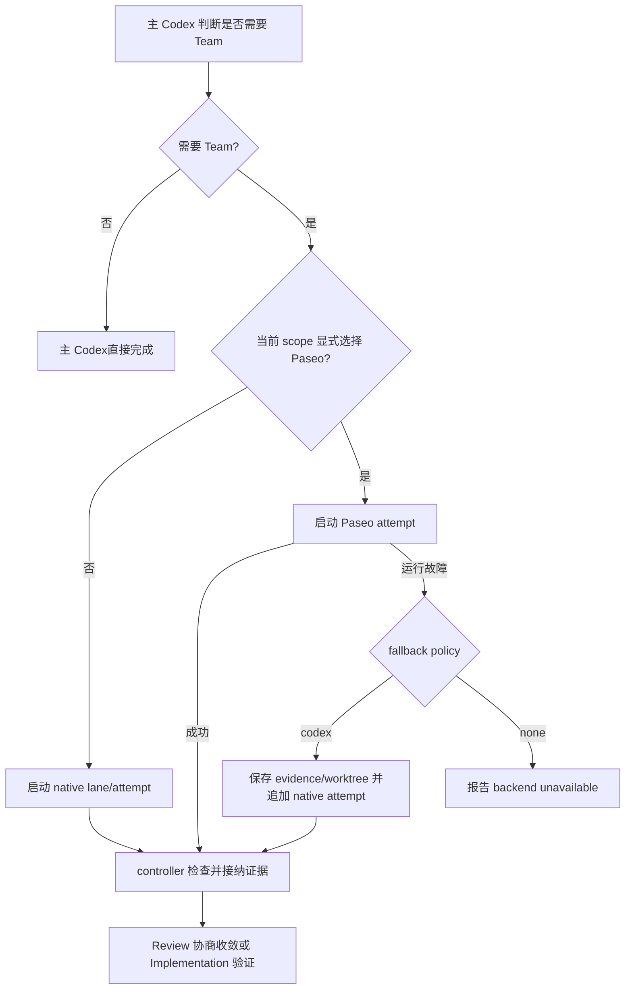

# Atlas Team Paseo 显式启用与 Codex 连续降级实施方案

workflow_id: `20260720-011-atlas-team-paseo-codex`
plan_status: `implementation-ready`
date: `2026-07-20`
authority: 当前用户确认的 Team 协作与降级方向
canonical_scope_source: 本文件
source_session: `019f7ea0-cc95-74e3-8153-297f18065857`
artifact_category: `implementation_plan`

## 1. 方案结论

Atlas Team 不再把 Paseo 当作默认后端。默认路径保持为主 Codex；只有任务确实需要 Team
时才进入 Team，而进入 Team 后若没有明确的 Paseo 选择，默认使用 Codex native collaboration。

Paseo 是显式、可局部选择的运行后端：调用方可以为整个 Team、一个逻辑 lane，或一次具体
dispatch 指定 Paseo。Review 和 implementation 都允许使用 Paseo agent，但互不强制；例如只让
Paseo 承担独立审查、由 Codex 实施，或者由 Paseo 实施、由 native Codex 审查。

显式选择 Paseo 时，默认 `fallback_policy` 为 `codex`。遇到额度、限流、provider/model/mode
不可用、认证失败、CLI/daemon 不可用、runtime crash 或持续无有效输出等运行故障时，主 Codex
保留既有证据和工作区状态，在同一个逻辑 lane 中追加 Codex attempt 并继续目标。只有用户明确
要求 `no-fallback`，才不做这种降级。

Team review 使用多角色讨价还价协议：角色与数量由当前风险推荐而不是预先规定；各 reviewer
先独立审查，主线程汇总、裁决并把材料返回给仍然存活的相关角色，通常用 2–3 轮收敛。轮数不是
语义上限；若多轮交换仍有会改变结论的重大分歧，且继续交流已不能产生新的决定性证据，则形成
人工裁决包，而不是假装达成一致。

本方案是后续实现的权威目标，不声称上述行为已经存在。实现完成前，当前源码、schema、测试和
manifest 仍定义实际运行行为。

## 2. Goal 与稳定需求引用

| Ref | Required outcome |
| --- | --- |
| `G-01` | 不请求 Team 时使用主 Codex；请求 Team 但未明确选择 Paseo 时使用 Codex native collaboration。 |
| `G-02` | Paseo 可在整个 Team、单个 lane 或单次 dispatch 上显式启用；Review 与 implementation 均支持 Paseo，但不相互继承或强制。 |
| `G-03` | 显式 Paseo 默认在运行故障时降级到 Codex；降级继续同一目标、同一逻辑 lane 和当前授权范围。 |
| `G-04` | Team review 支持动态角色、独立首轮、主线程裁决、原 reviewer 定向复议、证据驱动收敛及人工裁决。 |
| `G-05` | Team 持久状态能够区分 requested、attempted 与 effective backend，并保留每次 Paseo/Codex attempt 的来源、结果和失败原因。 |
| `G-06` | Paseo implementation 失败后，在确认单写者边界和保存局部 diff 后，由 native agent 或主 Codex安全接管，而不是重新开始或覆盖现有工作。 |
| `G-07` | 降级不得把缺失的 provider 视角、独立性或未取得的证据伪装成共识；最终交付必须披露实际后端与保留意见。 |
| `G-08` | Team 的角色、数量、审查轮数和 provider 组合是建议与遥测，不是固定 staffing gate 或完成上限。 |
| `G-09` | 任何 Claude-family model 都只能由用户或操作方手工提供精确 model ID 后使用；Atlas 不得自动推荐、选择或补全 Claude model。 |

## 3. 非目标与权限边界

- 不让每个 Team、每个 review round 或每个 implementation slice 都使用 Paseo。
- 不把 Team 变成普通任务的默认工作流；小而清晰的任务继续由主 Codex完成。
- 不规定固定角色集合、固定 agent 数量、固定 provider 数量或固定 reviewer council 形状。
- 不把 Claude 加入任何自动 provider/model 推荐；只指定 Paseo、purpose、role 或 Claude provider
  都不足以授权 Atlas 自动挑选 Claude model。
- 不把 2–3 轮变成强制停止条件，也不以时间、token、agent 数、commit 数或 tool call 数定义目标完成。
- 不自动读取或应用 `~/.paseo/orchestration-preferences.json`；Atlas 自己拥有 routing 决策。
- 不修改 Paseo provider 配置、认证、daemon 配置或全局偏好，不重启 daemon，不做全局 stop。
- 不把 runtime 的 full-access mode 当作写入授权；`discuss` 仍然只读，`execute` 仍需用户明确授权。
- 不把 test failure、代码缺陷、review 的 `REQUEST_CHANGES` 或角色分歧归类为 Paseo 运行故障。
- 不因 reviewer finding 自动扩大当前实现范围；只有当前 Goal、回归或安全/数据/权限问题可进入自动修复。
- 不修改或调用 `plugins/multica-sdlc/**`、`.agents/**`、Multica runtime、router、listener 或 tests。
- 不在本计划阶段修改 Team/Paseo 实现、刷新真实 cache/marketplace/runtime、运行 live provider E2E、push、PR、deploy 或 release。

## 4. 术语与选择优先级

### 4.1 术语

| 术语 | 定义 |
| --- | --- |
| controller | 当前任务的主 Codex，拥有整合、裁决、授权检查和最终交付责任。 |
| logical lane | 围绕一个具体目的和所有权持续存在的工作单元，例如“API 兼容性审查”或“实现配置解析”。 |
| dispatch | 对一个 lane 发出的一次具体工作请求；同一 reviewer 的后续复议是新的 dispatch，但仍属于原 lane。 |
| attempt | 一个 dispatch 在某个 backend/actor 上的一次执行记录；attempt 只追加、不原地改写历史结果。 |
| requested backend | 调用方为 Team、lane 或 dispatch 明确选择并经继承规则解析后的后端。 |
| attempted backend | 实际启动过 attempt 的后端；可同时包含 `paseo` 和 `native`。 |
| effective backend | 产生最终被 controller 接纳结果的后端；多后端证据共同构成结果时为 `mixed`。 |
| native | Codex native collaboration；具体 actor 可以是 native subagent 或主 Codex。 |
| fallback | Paseo 因运行故障不能继续时，在同一 logical lane 追加 native attempt 的连续接管。 |

### 4.2 选择优先级

按从高到低的顺序解析 backend：

1. 当前 dispatch 的显式选择；
2. 当前 logical lane 的显式选择；
3. Team 启动时的显式选择；
4. 默认 `native`。

只有显式值为 `paseo` 才能启动 Paseo agent。以下信息不能隐式选中 Paseo：

- 仅调用 `$atlas-workflow:team`；
- 角色名包含 reviewer、architect、implementer 等字样；
- 本地能够发现 Paseo 或多个 provider；
- 前一轮或另一个 lane 使用过 Paseo；
- 当前任务复杂、涉及多个文件或已有 implementation contract。

若 Team 级别显式选择 Paseo，该选择可以被具体 lane/dispatch 的显式 `native` 覆盖。若只为
review lane 选择 Paseo，implementation lane 不继承该选择。对已启动 Paseo reviewer 的定向复议
继续复用同一个 agent，不要求每轮重复选择；新 reviewer 或新 purpose 则重新按上述优先级解析。

### 4.3 Paseo 选择来源

允许的显式来源是：

- 用户在当前任务中要求 Paseo、multi-provider 或某个具体 provider/model；
- 调用方通过 Team 的 backend/lane/dispatch 参数明确写入 `paseo`；
- 已有、当前有效的 Team 配置将 Paseo 绑定到明确 purpose/lane。

每次 Paseo 选择都记录单行 `selection_ref`。它可以引用用户消息或当前 Team 配置，但不能由
provider 可用性、历史默认值或 skill 自行推断出来。

Claude 是额外的 fail-closed 例外：只要最终 model 属于 Claude family，无论通过 `claude` provider
还是 ZenMux 等 gateway 暴露，attempt 都必须保存用户或操作方手工提供的精确 model ID 与
`model_selection_ref`。Team 配置、角色映射、实时 catalog、“latest”推断或 Atlas 默认值都不能作为
Claude model 的选择来源。



## 5. 统一 lane/attempt 状态模型

Review 与 implementation 共用一个控制面，不各自维护一套后端和降级状态机。建议将当前
`active_team.backend` 单值升级为 schema v2，并保留向后兼容的派生摘要。

```json
{
  "active_team": {
    "schema_version": 2,
    "mode": "execute",
    "status": "running",
    "selection": {
      "default_backend": "native",
      "team_backend": "native",
      "fallback_policy": "codex"
    },
    "requested_backend": "mixed",
    "attempted_backends": ["paseo", "native"],
    "effective_backend": "native",
    "lanes": [
      {
        "lane_id": "review-api-compatibility",
        "purpose": "review",
        "role": "API compatibility skeptic",
        "requested_backend": "paseo",
        "fallback_policy": "codex",
        "selection_ref": "user-message:paseo-review-only",
        "effective_backend": "native",
        "status": "complete-with-reservation",
        "attempts": [
          {
            "attempt_id": "review-api-compatibility-01",
            "dispatch_id": "review-round-1",
            "backend": "paseo",
            "actor_type": "paseo-agent",
            "origin": "selected",
            "selection_ref": "user-message:paseo-review-only",
            "fallback_policy": "codex",
            "provider": "claude",
            "model": "caller-specified-claude-model-id",
            "model_selection": "manual",
            "model_selection_ref": "user-message:exact-claude-model",
            "runtime_mode": "discovered-mode-id",
            "runtime_agent_id": "paseo-agent-id",
            "workspace_id": "paseo-workspace-id",
            "status": "operational-failure",
            "failure": {
              "class": "quota_exhausted",
              "summary": "provider rejected the request because quota was exhausted"
            },
            "evidence_refs": []
          },
          {
            "attempt_id": "review-api-compatibility-02",
            "dispatch_id": "review-round-1",
            "backend": "native",
            "actor_type": "native-agent",
            "origin": "fallback",
            "fallback_from": "review-api-compatibility-01",
            "status": "succeeded",
            "evidence_refs": ["team/review-api-compatibility.md"]
          }
        ]
      }
    ],
    "fallback_events": [
      {
        "from_attempt": "review-api-compatibility-01",
        "to_backend": "native",
        "reason_class": "quota_exhausted",
        "preserved_evidence_refs": []
      }
    ]
  }
}
```

### 5.1 派生规则

- `requested_backend`：所有当前 lane/dispatch 解析结果只有 native 时为 `native`，只有 Paseo
  时为 `paseo`，两者并存时为 `mixed`。
- `attempted_backends`：从 append-only attempts 去重派生，不因失败或重试删除 Paseo。
- lane `effective_backend`：最终接纳结果只来自 native 时为 `native`，只来自 Paseo 时为
  `paseo`，两边有效证据共同进入裁决或实现时为 `mixed`。
- Team `effective_backend`：从所有已接纳 lane 结果派生；任一结果由不同后端共同构成，或不同
  lane 分别由 Paseo/native 交付时为 `mixed`。
- Paseo 失败且没有贡献可接纳证据、随后完全由 native 完成时，effective 可以是 `native`，但
  requested 和 attempted 仍清楚显示 Paseo 选择与失败。
- `agents`、`roles`、`providers` 变为从 lane/attempt 派生的摘要或可选 planning hint，不再要求
  Team 启动前冻结完整清单。

### 5.2 状态更新不变量

- attempt 只允许从 pending/running 进入终态，不允许覆盖、重排或删除旧 attempt。
- fallback event 必须引用一个已记录的 Paseo attempt，并说明失败分类、保留证据和目标 backend。
- dispatch 级 Paseo override 必须在 attempt 保存自己的 `selection_ref` 和 `fallback_policy`；从 Team
  或 lane 继承时也要保存解析后的有效值，保证历史不依赖可变配置回算。
- Claude-family attempt 必须同时保存精确 `model`、`model_selection=manual` 和指向用户/操作方
  明确输入的 `model_selection_ref`；任一缺失都禁止启动 runtime。
- 同一 writable lane 在任意时刻最多有一个 running writer attempt。
- `execute` lane 的每个 writable attempt 都必须继承有效 `authorization_ref`。
- provider、model、mode、agent ID 和 workspace ID 只记录实际观测值；未观测到时写
  `unverified` 或留空，不能伪造默认值。
- 对外显示的 legacy `team_backend` 从 v2 状态派生，不能反向覆盖 lane/attempt 真相。

## 6. Paseo 生命周期与路由合同

### 6.1 借鉴的 Paseo 能力

实现时参考以下 skill 的生命周期做法，但不把它们的 workflow 或偏好直接嵌入 Atlas：

- `/home/gewu/.agents/skills/paseo/SKILL.md`：精确 agent/workspace ID、send/wait/stop、worktree
  所有权和通知式等待。
- `/home/gewu/.agents/skills/paseo-advisor/SKILL.md`：advisor 是可选意见，主线程保留决策权；只有
  需要复议时才保持 agent 存活。
- `/home/gewu/.agents/skills/paseo-committee/SKILL.md`：主线程作为中间人汇总和转发，committee
  在 review 期间保持可复用；实施默认不自动转交 committee。
- `/home/gewu/.agents/skills/paseo-loop/SKILL.md`：worker 与 verifier 关注点分离，使用目标退出条件，
  不以盲目循环代替判断。

明确不继承这些 skill 的 orchestration preferences 读取行为；Atlas 的 provider/backend 选择由本
方案和当前用户指令决定。

### 6.2 Provider、model 与 mode

- 仅在某个 attempt 已明确解析为 Paseo 后，才运行 `paseo provider ls --json` 和
  `paseo provider models <provider> --json`。
- 用户明确指定 provider/model 时，以实时 catalog 中的精确可用值为准；不可用时不静默换成
  另一个 provider/model，而是按默认降级策略转 Codex并披露缺失视角。
- 只指定 Paseo 而未指定 provider/model 时，Atlas 可以按任务 purpose 推荐实时可用的非 Claude
  组合；推荐不是固定 staffing，也不能把 catalog 顺序臆测成“latest”。
- Claude-family model 不参加任何自动推荐。使用 `claude` provider，或通过任意 gateway 使用
  Claude-family model，都要求调用方手工同时提供 provider 与精确 model ID，并记录
  `model_selection=manual` 和 `model_selection_ref`。
- 只手工指定 `claude` provider、Claude family、角色或“使用 Claude”但没有精确 model ID 时，
  返回 `CLAUDE_MODEL_SELECTION_REQUIRED`，不启动 agent、不自动选择 catalog 中的 latest/current，
  也不静默改用另一 Claude model。
- 对 Claude 运行 `paseo provider models <provider> --json` 只用于验证人工指定的精确 model 是否
  存在和可用，不能参与 model 选择。已完整人工指定但运行时不可用时，归类为
  `model_unavailable` 并按默认策略降级到 Codex。
- provider 的 mode ID 必须从 live capability 获取并记录，不能硬编码 `bypass`、
  `bypassPermissions`、`full-access` 或 `yolo` 等跨 provider 假设。
- live capability 只返回展示标签、无法得到可调用 mode ID 时，将当前 attempt 归类为
  `mode_unavailable` 并按策略转 Codex，不从标签或历史值猜测 ID。
- `execute` 选择满足写入需求的 live mode；`discuss`/review 优先选择满足只读检查的 mode。若
  provider 只提供更宽 runtime mode，prompt 和 authorization 仍限制其为只读。
- thinking option、model、mode 都是 provider-specific；不把 Codex 参数复制到其他 provider。

### 6.3 生命周期操作

- `run` 后立即记录准确 agent ID、workspace ID、worktree path（若有）、base SHA 和 attempt ID。
- 后续复议只向目标 agent 使用精确 ID `send`，并用 `wait` 等待真实完成；不 busy-poll 列表。
- 只有目标 agent 仍在运行且继续运行会造成冲突、越界或浪费时，才对该精确 ID 执行 `stop`。
- 禁止 `paseo stop --all`、按 cwd 广泛 stop、daemon restart、agent delete 或 provider mutation。
- agent 完成只是证据，controller 仍需检查结果、diff 和验证；agent failure 也不自动判定目标失败。

Workflow helper 只负责 backend 解析、lane/attempt 账本、失败分类和原子状态转换。实际 Paseo
生命周期继续通过 Paseo CLI，native agent 生命周期继续通过 Codex collaboration tools；本次不
创建一个假装能统一执行两类 runtime 的通用 agent wrapper。

## 7. 运行故障分类与 Codex fallback

### 7.1 会触发 fallback 的故障

| Failure class | 典型证据 | 默认处理 |
| --- | --- | --- |
| `quota_exhausted` | credits/quota exhausted、insufficient balance | 记录后直接转 Codex。 |
| `rate_limited` | HTTP 429、rate limit、明确 Retry-After | Retry-After 落在当前交互可接受等待窗口内时允许一次受控重试，否则转 Codex。 |
| `provider_unavailable` | provider disabled、gateway unavailable、service unavailable | 转 Codex。 |
| `model_unavailable` | 精确 model 不存在、无权限或已下线 | 转 Codex并披露未取得指定 model 视角。 |
| `mode_unavailable` | 所需 live mode 不存在或 execute 无可用写入 mode | fail closed 当前 Paseo attempt，再转 Codex；不得降低 runtime mode 冒充成功。 |
| `authentication_failed` | login/token/credential 被 runtime 拒绝 | 转 Codex；不修改凭证。 |
| `cli_unavailable` | 找不到 Paseo CLI 或 CLI 无法启动 | 转 Codex。 |
| `daemon_unavailable` | daemon 无响应、连接失败 | 转 Codex；不重启 daemon。 |
| `runtime_crashed` | agent/runtime 非任务内容导致异常退出 | 保存已有输出后转 Codex。 |
| `timeout_no_useful_output` | 在任务相关等待窗口和一次聚焦唤醒后仍无可用输出 | 精确 stop 仍运行的目标 agent（仅在必要时），然后转 Codex。 |

同一 dispatch 对可恢复的 Paseo 运行故障最多进行一次自动重试，且只在明确 Retry-After 或短暂
runtime 恢复证据与用户等待预期相容时进行。该限制只防止静默 retry loop，不限制 review 的证据
交换轮数或整个任务的语义进展。

若错误文本不足以区分运行故障与任务结果，controller 先检查 exit code、结构化 JSON、agent
status 和已产出内容，再分类。未经分类的失败不能静默触发重试或伪造 fallback 原因。

### 7.2 不触发 fallback 的情况

- 测试失败、lint 失败、代码 bug、实现不完整或 reviewer 提出 `REQUEST_CHANGES`；
- reviewer 之间的实质分歧、证据不足或主线程不同意某个建议；
- 用户尚未授权 execute、commit、deploy、release 或其他外部 mutation；
- Claude provider/model 缺少人工提供的精确 model ID 或 `model_selection_ref`；这是输入门禁，返回
  `CLAUDE_MODEL_SELECTION_REQUIRED`，不是 runtime fallback；
- 当前目标或范围不清，继续会改变产品行为、权限、安全或数据语义；
- 用户需要接受风险、选择兼容策略或决定产品 intent；
- Paseo 已成功给出结论，只是结论不符合 controller 的预期。

这些情况按正常审查、修复、澄清或人工裁决处理，不能借“fallback”规避真实问题。

### 7.3 Fallback 算法

1. 冻结失败 attempt 的原始状态，记录结构化 failure class、简短脱敏摘要、已有输出和证据引用。
2. 检查 `fallback_policy`。默认 `codex` 继续；仅显式 `none`/`no-fallback` 返回 backend unavailable。
3. 若原 agent 仍运行，判断其是否会与接管者冲突。仅在必要时对精确 agent ID stop，并确认已不再
   pending/running。
4. 保留原 logical lane、purpose、role、scope、authority、acceptance 和已裁决 finding，不另建新
   roadmap 或扩大目标。
5. 根据独立性和写入所有权选择 native actor：需要独立 reviewer 时优先 native subagent；不需要
   独立性、native capacity 不可用或任务适合主线程时由主 Codex继续。
6. 追加 native attempt，向其提供原始任务、已验证证据、失败 Paseo attempt 的可用输出、主线程
   当前裁决和明确缺口；不得把未验证 Paseo 输出描述成事实。
7. native 完成后由 controller 验证、接纳或继续正常 repair/review；更新 effective backend 和最终
   disclosure，不删除 Paseo 失败历史。

## 8. 多角色讨价还价式 Review

### 8.1 动态 staffing

主线程先根据实际 review scope、风险和证据推荐互补视角。两到三个角色通常足够，但只是常见
建议；低风险任务可以一个 reviewer，高风险或跨域任务可以更多。角色名称、数量、provider 与
backend 都不是预设枚举。

选择角色时优先覆盖真实分歧面，例如行为正确性、兼容性、安全/权限、数据一致性、可运维性、
测试证据或最强反方论证。不要为了凑数量创建重复的通用 reviewer。

### 8.2 交换协议

1. **冻结 scope**：记录 working tree、commit range、PR、phase 或具体文件，以及适用 Goal、合同
   与已有检查。
2. **独立首轮**：各 reviewer 在看到其他角色结论前形成首轮立场。finding 包含稳定 ID、路径/行、
   证据、影响、建议和 evidence gap。
3. **主线程归并**：controller 合并重复 finding，但保留作者、原始严重度、异议和 provenance。
4. **初步裁决**：controller 依据用户 Goal、权威合同和仓库证据，对每个争议给出 accept、reject、
   narrow、needs-evidence 或 human-decision 的临时裁决。
5. **定向复议**：只把相关异议、对方最强证据和临时裁决发回原 reviewer；保持 agent 存活并复用，
   不关闭后重新创建，也不把完整历史广播给所有角色。
6. **证据更新**：需要验证时由合适角色或 controller 补充最小检查，再把新证据发送给仍有实质
   异议的角色。
7. **收敛判定**：普通目标是 2–3 轮；只要重大分歧仍可能被一次聚焦交换或验证改变，就允许继续。
8. **人工裁决**：多轮后仍存在会改变最终建议的重大分歧，且继续交换已不再产生决定性新证据，
   或分歧本质属于产品 intent、风险接受、兼容、权限、所有权时，返回人工裁决包。

agent 在提供首轮结果后不得自动关闭。关闭时机是：该角色的所有实质 finding 已收敛、被证据明确
裁决、转为人工决定且不再需要角色输入，或 runtime 故障需要 fallback/stop。

### 8.3 Paseo reviewer 失败时

- 若失败发生在独立首轮输出前，优先用 native subagent 接替并只提供原始 scope，尽量保留独立性。
- 若 Paseo 已产出局部证据，保留并明确标注其完整性；native 接替者得到局部材料和尚未回答的问题。
- 若明确要求的是某个 provider 的独特视角，该 provider 不可用后虽然默认继续 Codex review，但最终
  状态至少为 `CONSENSUS_WITH_RESERVATIONS`；若该视角是风险决策的必要条件，则为
  `HUMAN_DECISION_REQUIRED`。
- 若只能由主 Codex自审，结果可以是 best-effort controller review，但不能声称取得独立共识。

### 8.4 收敛输出

| 状态 | 含义 |
| --- | --- |
| `CONSENSUS` | 无未解决、会实质改变最终建议的分歧，且声称的独立证据已经取得。 |
| `CONSENSUS_WITH_RESERVATIONS` | 主结论可执行，但存在已披露的 provider 缺失、非阻塞 evidence gap 或保留意见。 |
| `HUMAN_DECISION_REQUIRED` | 存在 controller 无权代替用户决定的重大分歧，或关键独立视角/证据无法取得。 |

人工裁决包必须简短包含：一致事实、剩余分歧、各方最强证据、controller 推荐、可选决策及每个选项
影响。用户裁决后，仅在需要最终一致性检查时把新 authority 返回给相关原 reviewer。

## 9. Paseo Implementation 与 Codex 接管

### 9.1 启动条件

- Team 处于 `execute`，并持有当前用户消息的 `authorization_ref`。
- implementation lane 已有明确 owned paths、forbidden paths、acceptance、验证命令和 stop condition。
- Paseo 是该 lane/dispatch 的显式 requested backend，而不是从 review Paseo 选择隐式继承。
- 紧耦合改动只有一个 writable owner；并行 writer 必须有互斥文件/模块所有权和明确 integration owner。

### 9.2 正常实施

Paseo implementer 在记录的 worktree/workspace 中修改。controller 等待完成后检查状态、diff、未跟踪
文件、base/head、相关测试和越界路径。Paseo 的“完成”不自动成为 Team complete；只有 controller
接纳 diff 和验证证据后，attempt 才记为 succeeded/effective。

### 9.3 部分写入后的运行故障

1. 读取精确 agent 状态和其 worktree，不先启动第二个 writer。
2. 保存 `git status --short`、目标 diff、未跟踪文件列表、base/head 和必要日志摘要；不清理、不 reset、
   不覆盖用户已有改动。
3. 若 agent 仍可能写入，先等待合理的在途操作结束；继续会冲突时只 stop 精确 agent ID，并确认不再
   running/pending。
4. 记录 Paseo attempt 为 operational failure，并把已完成 diff、验证结果和未完成 acceptance 绑定到
   fallback event。
5. 优先让主 Codex或一个 native implementer 在同一个可访问 worktree 接管。若必须把 patch 转到授权
   worktree，先核对 base SHA、diff fingerprint 和目标 worktree 脏状态，按文件/hunk 精确转移。
6. native attempt 继续同一目标和 owned paths，先审阅现有 diff，再补齐缺口；不得从头重写并掩盖
   Paseo provenance。
7. 运行与 blast radius 相称的验证，并对最终组合 diff 做 normal review。

任何 test/code failure 都进入正常 repair loop，不继续触发 backend fallback。controller-admitted finding
可以创建 focused repair；相邻重构、历史缺陷和 roadmap 外增强保留为 follow-up。

## 10. Workflow helper 与 CLI 变更设计

### 10.1 兼容现有命令

现有 `team-record-start` 改为：

```text
codex-workflow team-record-start <task-id> "<objective>"
  --mode discuss|execute
  [--backend native|paseo]
  [--fallback-policy codex|none]
  [--agents N]
  [--roles "<planning-hints>"]
  [--providers "<requested-routing-summary>"]
  [--selection-ref <ref>]
  [--authorization-ref <user-message-ref>]
```

- `--backend` 省略时默认 `native`。
- `--backend paseo` 必须有 `--selection-ref`，但不要求启动前列出所有 agents、roles 或 providers。
- `--agents`、`--roles`、`--providers` 继续接受旧调用，作为 planning hint/兼容摘要；实际值由 lane/attempt
  记录校正。
- `--mode execute` 继续强制要求 `--authorization-ref`。
- 旧 state 无 schema v2 时按 schema v1 读取，不做破坏性迁移；第一次 v2 更新时保留旧字段并生成
  派生摘要。

### 10.2 新增 runtime-neutral 账本命令

```text
codex-workflow team-lane-open <task-id>
  --lane <lane-id> --purpose <free-form> --role <free-form>
  [--backend native|paseo] [--fallback-policy codex|none]
  [--selection-ref <ref>] [--writable]

codex-workflow team-attempt-open <task-id>
  --lane <lane-id> --attempt <attempt-id> --dispatch <dispatch-id>
  --backend native|paseo
  --actor-type main-codex|native-agent|paseo-agent
  [--origin selected|fallback]
  [--selection-ref <ref>] [--fallback-policy codex|none]
  [--fallback-from <attempt-id>]
  [--provider <id>] [--model <id>] [--runtime-mode <id>]
  [--model-selection manual|auto] [--model-selection-ref <ref>]
  [--runtime-agent-id <id>] [--workspace-id <id>] [--worktree <path>]

codex-workflow team-attempt-close <task-id>
  --lane <lane-id> --attempt <attempt-id>
  --status succeeded|operational-failure|semantic-failure|interrupted
  [--failure-class <class>] [--reason "<single-line-summary>"]
  [--evidence-ref <path-or-id>]

codex-workflow team-fallback-record <task-id>
  --lane <lane-id> --from-attempt <attempt-id> --to-backend native
  --reason-class <operational-class> --reason "<single-line-summary>"
  [--preserved-evidence-ref <path-or-id>]
```

约束如下：

- lane/role/purpose 是安全的自由文本或 ID，不增加固定枚举。
- Paseo attempt 必须能追溯到当前 dispatch 的显式选择或继承到的 Paseo selection；解析后的
  `selection_ref` 与 `fallback_policy` 写入 attempt，支持 dispatch 级 override。
- provider 为 `claude`，或 model metadata/model ID 指向 Claude family 时，必须提供精确 `--model`、
  `--model-selection manual` 和 `--model-selection-ref`；该 ref 必须指向用户或操作方的显式输入，
  不能指向 Atlas 自动生成的 recommendation/config。
- 非 Claude model 可以按现有显式选择或 Atlas 推荐规则记录 `model-selection=auto|manual`；这不改变
  Claude 的 manual-only 例外。
- `origin=fallback` 的 native attempt 必须通过 `fallback_from` 引用同 lane 的失败 Paseo attempt。
- `team-fallback-record` 只接受本方案列出的 operational class、已终止/失败的 Paseo attempt 和
  `fallback_policy=codex`；它记录决策但不冒充已经启动 native agent。
- 新 native attempt 只有在主 Codex或 collaboration actor 确实开始工作后才 open。
- 状态写入继续使用 task lock 和原子更新；CLI 不直接启动/停止 Paseo 或 native runtime。
- `team-status` 新增 requested/attempted/effective backend、lane、attempt、fallback reason 和 actor 摘要，
  同时保留现有字段供旧调用读取。
- `team-record-finalize` 和 `team-loop-record` 从实际 lane 结果派生 backend marker；混合结果允许
  `backend: mixed`，并要求 artifact 披露各 lane 来源。

### 10.3 失败分类实现

增加纯函数分类器，优先读取 Paseo JSON 的结构化 code/status，再使用受控 message patterns；分类器
返回 failure class、是否可重试、Retry-After 和脱敏摘要。fixture 覆盖 quota、429、provider/model/mode、
auth、CLI/daemon、crash、timeout 和 unknown。unknown 交给 controller 判定，不自动声称具体原因。

该分类器不执行 sleep、retry、stop 或 fallback；这些动作由 controller 按当前交互预算和权限完成，
账本命令只验证并记录事实。

## 11. 后续实施文件边界

### 11.1 Atlas plugin source

- `plugins/atlas-workflow/skills/team/SKILL.md`
  - 把默认 Paseo 改为 Team 内默认 native、Paseo 显式 opt-in；
  - 加入 selection scope、lane/attempt、运行故障分类与 Codex 连续接管；
  - 保留并强化动态 staffing、多角色审查和 authority 边界；
  - 删除当前“planning/architecture/product reasoning 默认分配 Claude”的角色映射，不用另一个
    自动 Claude 规则替代；
  - 加入 direct/gateway Claude 的精确 model manual-only gate；
  - 修正 provider mode 不能跨 provider 硬编码的说明。
- `plugins/atlas-workflow/skills/analyze/SKILL.md`
  - 去掉“discussion/staffing 默认 Paseo”的路由，改为 Team 按需、Paseo 另行明确选择。
- `plugins/atlas-workflow/skills/clarify/SKILL.md`
  - 同步 Team/Paseo 选择语义，不让 clarify 隐式推广 Paseo。
- `plugins/atlas-workflow/README.md`
  - 更新用户可见的默认后端、局部 Paseo 选择、Claude model 人工指定和 fallback/disclosure 合同。
- `plugins/atlas-workflow/.codex-plugin/plugin.json`
  - 修改 skill description/default prompt 中“Paseo-backed default”表述；若包含 provider 推荐，不得
    自动指向 Claude。
- `plugins/atlas-workflow/scripts/codex-team-artifact-lint`
  - 允许并校验 `native|paseo|mixed` backend metadata；mixed artifact 必须能追溯 lane/attempt 来源，
    不再把所有 round 强制解释为 native。

### 11.2 Workflow helper

- `workflow/bin/lib/codex-workflow/team/commands.js`
  - 启动参数兼容、lane/attempt/fallback 命令、状态派生和 legacy 读取。
- `workflow/bin/lib/codex-workflow/team/cli.js`
  - 注册新命令与 usage。
- `workflow/bin/lib/codex-workflow/cli.js`
  - 根路由登记。
- `workflow/bin/lib/codex-workflow/team/backend-failures.js`
  - 纯函数运行故障分类器。
- `workflow/bin/lib/codex-workflow/team/lane-registry.js`
  - 独立承载 schema v2 验证、append-only transition、单写者不变量与 backend 派生；
    `commands.js` 只负责参数解析、task lock 和调用 registry，避免把状态规则复制到各命令；
  - 识别 direct provider 与 gateway model 中的 Claude family，并执行 manual model selection gate。
- `workflow/templates/team-decision.md`、`workflow/templates/team-staffing.md`
  - 默认仍初始化为 native；显式 Paseo 或 mixed Team 在 finalization 前更新为实际派生 backend，并
    在需要时列出 lane provenance。

### 11.3 Tests

- `workflow/tests/js/team-commands.test.js`
  - default native、显式 Paseo selection、动态 lane、append-only attempts、fallback、mixed backend、
    execute authority、单 writer、Claude manual-only gate 和 legacy state；
  - 覆盖 generic Paseo 不选择 Claude、仅 provider=claude 失败、gateway Claude 无 manual ref 失败、
    精确人工 model/ref 通过，以及精确 model 运行时不可用后转 Codex。
- `workflow/tests/js/team-backend-failures.test.js`
  - 结构化与文本 fixture 的确定性分类、unknown fail-closed 和 Retry-After。
- `workflow/tests/contract_team_native.sh`
  - Team 未明确 Paseo 时的 native 默认与动态 role/count。
- `workflow/tests/contract_team_paseo.sh`
  - Paseo 显式启用、selection ref、provider 运行值、Claude manual-only 和 no-fallback。
- `workflow/tests/contract_team_fallback.sh`
  - Paseo operational failure 到 native attempt 的连续账本、证据保留与最终 disclosure。
- `workflow/tests/contract.sh`
  - source guidance、manifest/README 与 CLI route 的集成断言。

计划范围不包含 `workflow/bin/codex-workflow-legacy` 的新 runtime lane 行为；只有主 CLI 兼容测试证明
必须同步 usage 或路由时，才做最小改动，不复活 legacy `codex exec` team lanes。

## 12. 实施切片与提交策略

### Slice A：runtime-neutral Team 控制面

1. 先写 schema v2、backend 继承/派生、append-only transition 和 failure classifier 的 unit tests。
2. 修改 helper 命令，使 Team 默认 native，旧参数继续可读，新 lane/attempt/fallback 命令可用。
3. 覆盖 execute authorization、单 writer、Claude manual-only selection、invalid transition、unknown
   failure 和 legacy state。
4. 形成一个可独立回退的逻辑提交：`feat(workflow): track team backend attempts and fallback`。

### Slice B：Atlas skill 与用户合同

1. 修改 Team、Analyze、Clarify、plugin README 和 manifest metadata，统一为 Paseo 显式 opt-in，
   删除 role-to-Claude 自动默认并加入 Claude exact-model manual-only 合同。
2. 把 review bargaining、implementation takeover、provider perspective loss 和 final disclosure 绑定到
   lane/attempt 控制面。
3. 更新 native/Paseo/fallback shell contracts 和集成断言。
4. 完成内容 review 后冻结 plugin tree，最后运行 Atlas cachebuster。
5. 形成一个可独立理解的逻辑提交：`feat(atlas): make Paseo opt-in with Codex fallback`。

两个 slice 都在当前授权 Goal 内时可连续实施，不因内部 slice 例行等待确认。commit 不推导出 push、
PR、安装态刷新、release 或 live E2E 权限。

## 13. 验收条件

| Ref | Acceptance |
| --- | --- |
| `AC-01` | 未请求 Team 的示例仍由主 Codex处理；Team start 未传 backend 时状态明确为 native。 |
| `AC-02` | Team、lane 和 dispatch 三层显式选择都可表达；只有明确 Paseo selection 才能 open Paseo attempt，未相关 lane 不继承。 |
| `AC-03` | Team 可在启动后动态增加/复用 lane，不要求预先固定 agent 数、role 列表或 provider 清单。 |
| `AC-04` | 同一 lane 中 Paseo failure 和后续 native attempt 均保留；requested、attempted、effective backend 派生正确。 |
| `AC-05` | quota、429、provider/model/mode、auth、CLI/daemon、crash、timeout fixture 能确定分类并允许默认 Codex fallback。 |
| `AC-06` | test failure、code bug、`REQUEST_CHANGES`、scope/authority conflict 不会被分类为 operational fallback。 |
| `AC-07` | 用户显式 `no-fallback` 时 Paseo failure 不启动 native attempt；默认策略则为 `codex`。 |
| `AC-08` | Paseo reviewer 失败后可由 native reviewer 接管；缺少指定 provider 视角或独立 reviewer 时，状态和最终摘要不会声称完整 consensus。 |
| `AC-09` | Review agent 首轮后可被同 ID 定向复议；2–3 轮只是目标，重大分歧可继续，证据不再增长时输出人工裁决包。 |
| `AC-10` | Paseo writer 部分失败后，第二 writer 只能在原 writer 不再运行且 diff/worktree evidence 已保存后启动。 |
| `AC-11` | `execute` 的所有 writable attempts 都要求有效 `authorization_ref`，fallback 不扩大路径、目标或外部 mutation 权限。 |
| `AC-12` | `team-status` 与最终文档披露 requested/effective backend、fallback reason、保留证据、缺失 provider 视角和人工选择。 |
| `AC-13` | 旧 schema v1 Team state、现有 native/Paseo record 调用和读取在兼容层中有明确测试，不需要批量迁移历史 artifacts。 |
| `AC-14` | Atlas source、README、manifest 和测试中不再把 Paseo 描述为 Team 默认，也不读取 Paseo orchestration preferences。 |
| `AC-15` | forbidden paths、Multica source/runtime、真实 marketplace/cache/runtime 均无修改。 |
| `AC-16` | Generic Paseo routing 永不自动选择 Claude；direct/gateway Claude 只有在人工提供精确 model ID 和有效 `model_selection_ref` 时才能启动，否则返回 `CLAUDE_MODEL_SELECTION_REQUIRED`。 |

## 14. 验证矩阵

先运行最小专项测试：

```bash
node --test workflow/tests/js/team-commands.test.js
node --test workflow/tests/js/team-backend-failures.test.js
bash workflow/tests/contract_team_native.sh
bash workflow/tests/contract_team_paseo.sh
bash workflow/tests/contract_team_fallback.sh
```

然后运行 plugin 与仓库合同：

```bash
python3 "${CODEX_HOME:-$HOME/.codex}/skills/.system/plugin-creator/scripts/validate_plugin.py" plugins/atlas-workflow
workflow/bin/atlas-plugin-integrity manifest --plugin-root plugins/atlas-workflow
bash workflow/tests/contract_repo.sh
scripts/check-relative-markdown-links.py --root .
git diff --check
```

内容和 reviewer 结论冻结后，最后更新 plugin release identity：

```bash
scripts/bump-plugin-cachebuster.sh atlas-workflow
```

cachebuster 后不得再修改 `plugins/atlas-workflow/**`。若必须修改，重新进行内容 review、专项验证并生成
新的 cachebuster。最终跨域集成运行：

```bash
bash workflow/tests/contract.sh
```

所有验证都要核对 changed paths 和 Multica hard fingerprints。live Paseo provider E2E 不属于普通开发
验证；只有另行授权后才在隔离 worktree 中执行，并且不得修改 provider/daemon/global preferences。

## 15. 最终交付 disclosure

任何实际使用 Paseo 或发生 fallback 的 Team，最终摘要至少包含：

- Paseo 是在哪个 Team/lane/dispatch 被明确选择的，以及 `selection_ref`；
- requested、attempted 与 effective backend；
- 实际 provider/model/mode（可验证时）和 actor 类型；
- 使用 Claude-family model 时的人工 `model_selection_ref`；
- fallback failure class、是否做过一次受控 retry，以及接管者；
- 保留下来的 Paseo 输出、diff、worktree 或验证证据；
- 因 provider 不可用而失去的独立性、专业视角或证据强度；
- review 的 `CONSENSUS`、`CONSENSUS_WITH_RESERVATIONS` 或
  `HUMAN_DECISION_REQUIRED` 状态；
- 仍需用户决定的具体事项，以及未执行的 live E2E、push、release 等外部动作。

## 16. 风险、关键反馈与停止条件

### 16.1 已接受的关键反馈

- **当前默认方向错误**：现有 Team skill、Analyze、Clarify、README 和 plugin metadata 把 Paseo 当默认，
  与“特别指定才使用”的目标冲突，必须一起修改，不能只补一句 fallback。
- **单一 backend 会丢失事实**：从 Paseo 降级到 native 后若覆盖 `active_team.backend`，就无法说明谁
  实际做过什么；因此采用 lane + append-only attempts 和三种 backend 视图。
- **Review 与 implementation 不能各自发明降级**：两者共用状态与失败分类，但分别保留独立性和
  单写者约束。
- **缺失 provider 不等于一致**：Codex可以继续任务，但不能弥补某个明确 provider 的独特视角；
  disclosure 和 reservation/human decision 是合同的一部分。
- **实时 mode/model 不能靠硬编码猜测**：provider capability 必须 live discover，无法验证就诚实标记。
- **Claude model 不允许自动选择**：Claude 只能验证并使用人工给出的精确 model；generic Paseo 推荐
  必须排除 direct/gateway Claude，缺少人工 model 时 fail closed。

### 16.2 明确拒绝的路径

- 拒绝“所有 Team 默认 Paseo，失败才 native”的全局路由。
- 拒绝固定 planner/implementer/reviewer/verifier 数量与 provider 矩阵。
- 拒绝为每轮 review 重建 agent，或 reviewer 首轮完成后立即关闭。
- 拒绝把 2–3 轮变成硬上限，或在没有证据增长时无限重复角色观点。
- 拒绝 provider 间静默替换、无限 retry、daemon restart、broad stop 和 preferences mutation。
- 拒绝按 role 默认 Claude、从 Claude catalog 自动挑 latest/current，或只指定 Claude provider 后
  自动补全 model。
- 拒绝把主 Codex自审包装成独立 reviewer consensus。
- 拒绝因 fallback 重新定义目标、自动纳入所有 finding 或启动未授权写入。

### 16.3 实施停止条件

后续实施遇到以下任一条件时停止相关 slice 并返回用户，而不是扩大方案：

- 需要改变用户明确要求的 Paseo opt-in 或默认 Codex fallback 语义；
- 需要读取/修改全局 Paseo preferences、凭证、provider 配置或重启 daemon；
- 需要修改 Multica forbidden paths 或通过共享同步入口间接写入 Multica；
- 旧 state 兼容只能通过破坏性迁移或丢弃历史 evidence 实现；
- exact-provider 失败后的继续方式涉及用户必须接受的风险或视角缺失；
- live provider、安装态、marketplace、push、PR、deploy 或 release 变成完成所必需，但尚未获得授权；
- 多角色 review 在多轮证据交换后仍存在会改变实现方向的重大分歧。
- 当前指令要求 Claude，但用户或操作方没有提供精确 model ID；返回
  `CLAUDE_MODEL_SELECTION_REQUIRED` 等待人工选择，不代选。

## 17. 完成定义

只有同时满足以下条件，后续实现才能标记完成：

- `G-01` 至 `G-09` 均有代码、skill 合同或测试证据；
- `AC-01` 至 `AC-16` 全部通过；
- Team 默认行为、Paseo 显式选择、fallback、review 收敛和 implementation 接管在 source/README/
  manifest/helper/tests 中一致；
- plugin 内容 review 已收敛，cachebuster 是最后一次 plugin tree 修改，完整验证通过；
- 最终 diff 未命中 forbidden paths，未修改 Multica 或真实安装态；
- 交付摘要真实披露 actual backend、fallback、证据损失与剩余人工选择。
